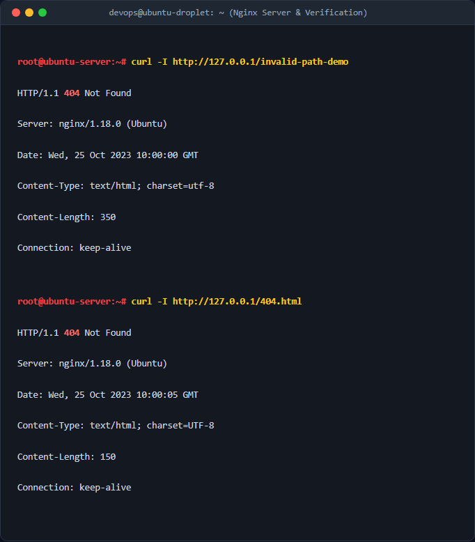

# Cấu hình trang lỗi tùy chỉnh (Custom Error Page 404) trên Nginx

## 1. Mục tiêu & Bối cảnh kỹ thuật
- **Mục tiêu**: Cấu hình dịch vụ Web Server Nginx để phục vụ một trang lỗi 404 (Not Found) tự thiết kế thay cho trang báo lỗi mặc định của hệ thống.
- **Yêu cầu bảo mật**: Sử dụng chỉ thị `internal` của Nginx để ngăn chặn người dùng truy cập trực tiếp vào tệp nguồn `404.html` từ internet.
- **Môi trường**: Linux Ubuntu Server, Nginx Web Server.

## 2. Các bước thực hiện chi tiết

### Bước 1: Tạo thư mục web root và tệp tin `404.html`
Sử dụng lệnh sau để tạo thư mục chứa mã nguồn web và tệp giao diện lỗi:
```bash
sudo mkdir -p /var/www/my-web/html
sudo nano /var/www/my-web/html/404.html
```
*- Giải thích các cờ:*
- `-p`: Cờ `--parents` hoặc `-p` của lệnh `mkdir` cho phép tạo toàn bộ cây thư mục cha nếu chưa tồn tại mà không báo lỗi.

### Bước 2: Cấu hình Server Block Nginx
Tạo và chỉnh sửa tệp cấu hình Server Block:
```bash
sudo nano /etc/nginx/sites-available/my-web.conf
```
Nội dung cấu hình bao gồm việc chỉ định `error_page 404 /404.html;` và block `location = /404.html` chứa chỉ thị `internal`.

### Bước 3: Kích hoạt cấu hình và kiểm tra
Kích hoạt site bằng cách tạo symbolic link và kiểm tra lỗi cú pháp:
```bash
sudo ln -s /etc/nginx/sites-available/my-web.conf /etc/nginx/sites-enabled/
sudo nginx -t
sudo systemctl reload nginx
```
*- Giải thích các lệnh:*
- `ln -s`: Tạo một liên kết mềm (symbolic link) từ thư mục `sites-available` sang `sites-enabled`.
- `nginx -t`: Kiểm tra tính hợp lệ của cú pháp file cấu hình Nginx trước khi apply.
- `systemctl reload nginx`: Tải lại cấu hình Nginx mà không làm gián đoạn các kết nối hiện tại.

## 3. Kiểm tra & Xác thực kết quả
Thực hiện các lệnh `curl` để kiểm tra phản hồi từ server:

```bash
curl -I http://127.0.0.1/invalid-path-demo
curl -I http://127.0.0.1/404.html
```



## 4. Kết luận & Best Practices bảo mật vận hành
- **Bảo mật**: Việc sử dụng `internal` giúp chặn tuyệt đối việc người dùng bên ngoài duyệt trực tiếp file `404.html`, tránh lộ thông tin thiết kế giao diện hệ thống hoặc bị lợi dụng chiếm dụng tài nguyên.
- **Vận hành**: Luôn luôn chạy lệnh `sudo nginx -t` trước khi thực hiện `reload` hoặc `restart` dịch vụ Nginx để tránh sập hệ thống web do lỗi cú pháp cấu hình.